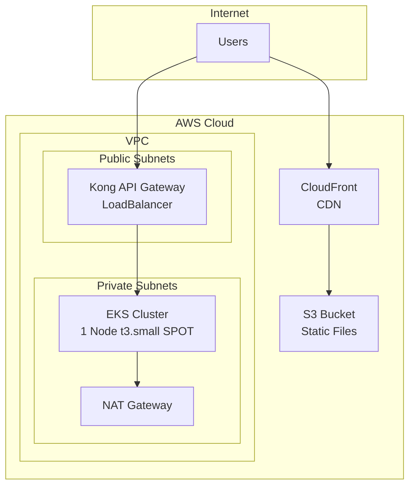

# 🌾 Farmers Market Infrastructure

A production-ready AWS infrastructure for The Farmers Market project using Terraform. Optimized for minimal microservices deployment with proper environment isolation and cost optimization.

## 📋 Table of Contents

- [Overview](#-overview)
- [Architecture](#️-architecture)
- [Quick Start](#-quick-start)
- [Costs](#-costs)
- [Deployment](#-deployment)

## 🎯 Overview

This infrastructure provides:

- **EKS Cluster**: Managed Kubernetes cluster for microservices
- **Kong API Gateway**: Load balancer and API management
- **VPC**: Isolated network with public/private subnets
- **State Management**: Isolated Terraform state per environment
- **CI/CD**: Automated deployment with GitHub Actions

## 🏗️ Architecture



## 🚀 Quick Start

### Prerequisites
- AWS CLI configured
- Terraform >= 1.6.0
- kubectl

### Deploy
```bash
# 1. Clone repository
git clone https://github.com/vishwaraja/farmers-market-infra.git
cd farmers-market-infra

# 2. Bootstrap state management
./scripts/bootstrap-state.sh dev

# 3. Deploy infrastructure
cd environments/dev
terraform init
terraform plan
terraform apply
```

## 💰 Costs

### Current Infrastructure Costs (Monthly)

| Environment | EKS | Kong/ALB | NAT Gateway | CloudFront | S3 | **Total** |
|-------------|-----|----------|-------------|------------|----|-----------| 
| **Dev** | $15.20 | $16.05 | $32.40 | $1.20 | $0.38 | **$53.23** |
| **Production** | $30.40 | $16.05 | $32.40 | $1.20 | $0.38 | **$80.43** |

### Cost Optimization Applied
- ✅ **SPOT instances** (60-70% savings on compute)
- ✅ **Single NAT Gateway** (shared across AZs)
- ✅ **Right-sized resources** (t3.small for dev, t3.medium for prod)
- ✅ **Regional CloudFront** (PriceClass_100)

### Cost Monitoring
- **Infracost**: Real-time cost estimates in PRs
- **AWS Cost Explorer**: Monthly cost tracking
- **AWS Budgets**: Cost alerts and thresholds

## 🚀 Deployment

### Manual Deployment
```bash
# Deploy to dev
cd environments/dev
terraform apply

# Deploy to production
cd environments/production
terraform apply
```

### Automated Deployment
- **Dev**: Auto-deploy on push to `dev` branch
- **Production**: Manual approval required on push to `main` branch

### CI/CD Features
- ✅ **Terraform validation** and formatting
- ✅ **TFLint** and **Checkov** security scanning
- ✅ **Infracost** cost estimation in PRs
- ✅ **Infrastructure testing** after deployment

## 📁 Project Structure

```
farmers-market-infra/
├── environments/
│   ├── dev/           # Development environment
│   └── production/    # Production environment
├── modules/
│   ├── compute/       # EKS cluster
│   ├── networking/    # VPC and subnets
│   ├── security/      # IAM and security groups
│   ├── services/      # Kong API Gateway
│   └── storage/       # S3 and CloudFront
├── .github/workflows/ # CI/CD pipelines
└── docs/             # Documentation
```

## 🔧 Troubleshooting

### Common Issues
- **Terraform state locked**: Check DynamoDB table
- **EKS connection failed**: Update kubeconfig with `aws eks update-kubeconfig`
- **Node group issues**: Check instance types and capacity

### Getting Help
- Check [Troubleshooting Guide](docs/TROUBLESHOOTING.md)
- Review [Architecture Documentation](docs/ARCHITECTURE.md)
- Open an issue for support

## 📄 License

MIT License - see [LICENSE](LICENSE) file for details.

## 📞 Support

- **Documentation**: [docs/](docs/)
- **Issues**: [GitHub Issues](https://github.com/vishwaraja/farmers-market-infra/issues)
- **Discussions**: [GitHub Discussions](https://github.com/vishwaraja/farmers-market-infra/discussions)