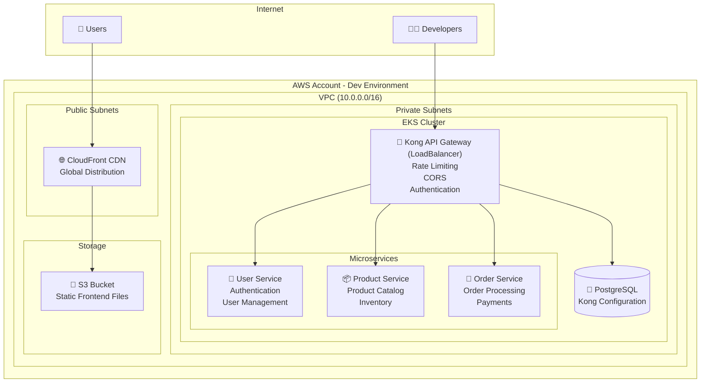
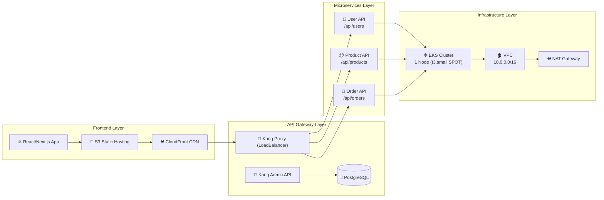
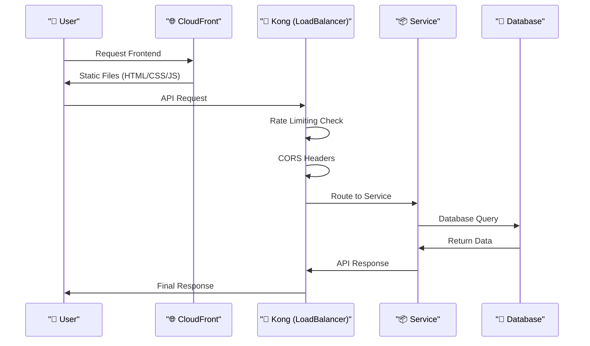
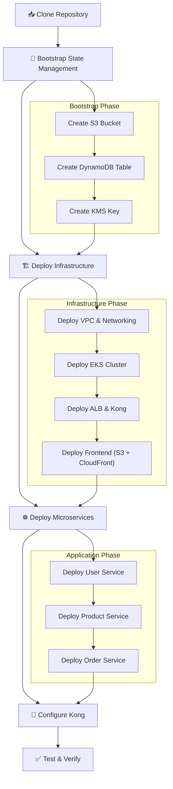
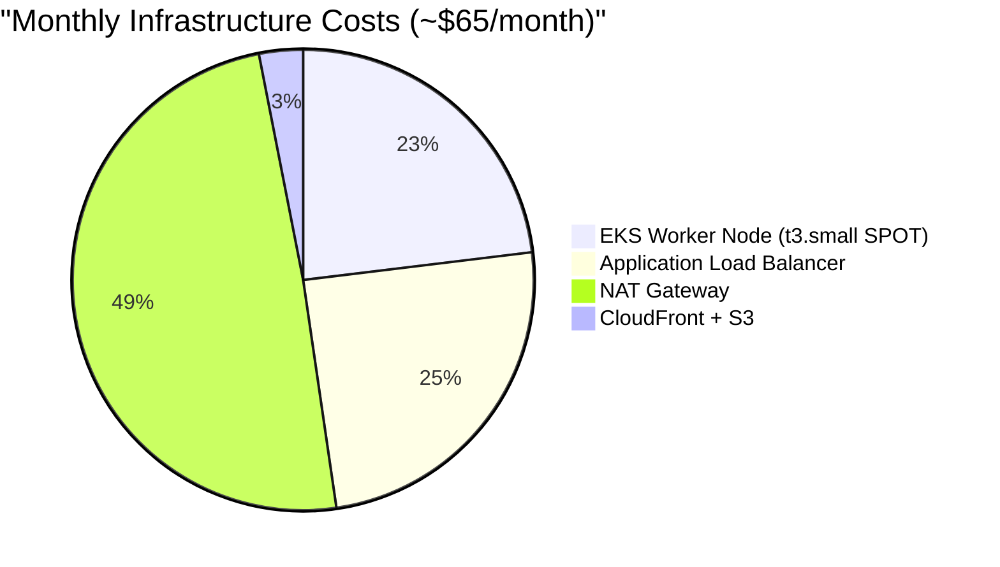

# 🌾 Farmers Market Infrastructure

A well-structured, production-ready AWS infrastructure for The Farmers Market project using Terraform. This infrastructure is optimized for minimal microservices deployment (2-3 services) with proper environment isolation and cost optimization.

## 📋 Table of Contents

- [Overview](#-overview)
- [Architecture](#️-architecture)
- [Project Structure](#-project-structure)
- [Prerequisites](#-prerequisites)
- [Quick Start](#-quick-start)
- [Environments](#-environments)
- [Deployment](#-deployment)
- [Cost Optimization](#-cost-optimization)
- [Infracost Setup](#-infracost-setup)
- [Security](#-security)
- [Monitoring](#-monitoring)
- [Troubleshooting](#-troubleshooting)
- [Contributing](#-contributing)

## 🎯 Overview

This infrastructure provides:

- **EKS Cluster**: Managed Kubernetes cluster for microservices
- **VPC**: Isolated network environment with public/private subnets
- **Security Groups**: Proper network security with least privilege
- **State Management**: Isolated Terraform state per environment
- **Cost Optimization**: Spot instances for dev, right-sized resources
- **Environment Isolation**: Separate dev and production environments

## 🏗️ Architecture

### **High-Level Overview**



### **Detailed Component Architecture**



### **Data Flow Architecture**



## 📁 Project Structure

```
farmers-market-infra/
├── modules/                          # Reusable Terraform modules
│   ├── networking/                   # VPC, subnets, security groups
│   │   ├── main.tf
│   │   ├── variables.tf
│   │   ├── outputs.tf
│   │   └── versions.tf
│   ├── compute/                      # EKS cluster and node groups
│   │   ├── main.tf
│   │   ├── variables.tf
│   │   ├── outputs.tf
│   │   └── versions.tf
│   ├── storage/                      # S3 static hosting + CloudFront
│   │   ├── main.tf
│   │   ├── variables.tf
│   │   ├── outputs.tf
│   │   └── versions.tf
│   ├── api-gateway/                  # ALB (deprecated - Kong now handles load balancing)
│   │   ├── main.tf
│   │   ├── variables.tf
│   │   ├── outputs.tf
│   │   └── versions.tf
│   ├── security/                     # IAM, security groups, access control
│   │   ├── main.tf
│   │   ├── variables.tf
│   │   ├── outputs.tf
│   │   ├── service-roles.tf
│   │   └── versions.tf
│   └── services/                     # Kong API Gateway (LoadBalancer)
│       ├── main.tf
│       ├── variables.tf
│       ├── outputs.tf
│       ├── versions.tf
│       └── templates/
│           └── kong.yml.tpl
├── environments/                     # Environment-specific configurations
│   ├── dev/                         # Development environment
│   │   ├── main.tf
│   │   ├── variables.tf
│   │   ├── terraform.tfvars.example
│   │   ├── backend.tf
│   │   ├── providers.tf
│   │   └── outputs.tf
│   └── production/                  # Production environment
│       ├── main.tf
│       ├── variables.tf
│       ├── terraform.tfvars.example
│       ├── backend.tf
│       ├── providers.tf
│       └── outputs.tf
├── shared/                          # Shared configurations
│   ├── locals.tf                    # Common local values
│   ├── tags.tf                      # Standardized tagging
│   └── versions.tf                  # Provider version constraints
├── scripts/                         # Deployment and utility scripts
│   ├── deploy.sh                    # Deployment script
│   ├── bootstrap.sh                 # Bootstrap state management
│   └── validate.sh                  # Validation script
├── docs/                           # Documentation
│   ├── DEPLOYMENT.md                # Detailed deployment guide
│   └── ARCHITECTURE.md              # Architecture documentation
└── .gitignore
```

## 🔧 Prerequisites

Before deploying the infrastructure, ensure you have:

### Required Tools
- **Terraform** >= 1.5.0
- **AWS CLI** >= 2.0
- **kubectl** >= 1.28
- **Git**

### AWS Requirements
- AWS Account with appropriate permissions
- AWS CLI configured with credentials
- IAM permissions for EKS, VPC, S3, DynamoDB, KMS

### Installation Commands

```bash
# Install Terraform (macOS)
brew install terraform

# Install AWS CLI (macOS)
brew install awscli

# Install kubectl (macOS)
brew install kubectl

# Configure AWS CLI
aws configure
```

## 🚀 Quick Start

### **Deployment Flow**



### 1. Clone and Setup

```bash
git clone <repository-url>
cd farmers-market-infra
```

### 2. Bootstrap State Management

```bash
# Bootstrap dev environment
./scripts/bootstrap.sh dev

# Bootstrap production environment
./scripts/bootstrap.sh production
```

### 3. Deploy Infrastructure

```bash
# Deploy dev environment
./scripts/deploy.sh dev init
./scripts/deploy.sh dev plan
./scripts/deploy.sh dev apply

# Deploy production environment
./scripts/deploy.sh production init
./scripts/deploy.sh production plan
./scripts/deploy.sh production apply
```

### 4. Deploy Microservices

```bash
# Deploy sample microservices
kubectl apply -f k8s/namespace.yaml
kubectl apply -f k8s/user-service.yaml
kubectl apply -f k8s/product-service.yaml
kubectl apply -f k8s/order-service.yaml
```

### 5. Connect to EKS Cluster

```bash
# Configure kubectl for dev
aws eks update-kubeconfig --region us-east-1 --name farmers-market-dev

# Verify cluster
kubectl get nodes
kubectl get pods -A
```

## 🌍 Environments

### Development Environment
- **Purpose**: Development and testing
- **Resources**: Minimal (1 node, t3.small, SPOT)
- **Cost**: ~$30-50/month
- **Features**: Public endpoint, spot instances, minimal monitoring

### Production Environment
- **Purpose**: Production workloads
- **Resources**: Production-ready (3 nodes, t3.medium, ON_DEMAND)
- **Cost**: ~$200-300/month
- **Features**: Private endpoint, on-demand instances, full monitoring

## 🚀 Deployment

### Manual Deployment

```bash
# Navigate to environment directory
cd environments/dev

# Initialize Terraform
terraform init

# Plan changes
terraform plan

# Apply changes
terraform apply

# Destroy (when needed)
terraform destroy
```

### Automated Deployment

```bash
# Using deployment script
./scripts/deploy.sh dev apply

# With auto-approval
./scripts/deploy.sh dev apply --yes

# Plan only
./scripts/deploy.sh dev apply --plan
```

## 💰 Cost Optimization

### **Cost Breakdown Diagram**



### **Development Environment**
- **Spot Instances**: 60-70% cost savings
- **Single NAT Gateway**: Shared across AZs
- **Minimal Node Count**: 1 node with auto-scaling
- **Small Instance Types**: t3.small

### **Production Environment**
- **On-Demand Instances**: Stable pricing and availability
- **Multiple NAT Gateways**: High availability
- **Right-sized Resources**: t3.medium for microservices
- **Auto-scaling**: Scale based on demand

### **Cost Monitoring**
- Enable AWS Cost Explorer
- Set up billing alerts
- Use AWS Budgets for cost control

## 💰 Infracost Setup

Infracost provides real-time cost estimates for your Terraform infrastructure changes directly in pull requests.

### **Quick Setup:**
1. **Get API Key**: Sign up at [Infracost Cloud](https://infracost.io/cloud) (free)
2. **Add Secret**: Add `INFRACOST_API_KEY` to GitHub repository secrets
3. **Create PR**: Infracost will automatically comment with cost estimates

### **What You'll See:**
- **Cost breakdown** by resource
- **Cost changes** between commits
- **Optimization suggestions** (Spot instances, right-sizing)
- **Budget alerts** for large changes

### **Example PR Comment:**
```markdown
## 💰 Infrastructure cost estimate

| Project | Previous | New | Diff |
|---------|----------|-----|------|
| **Total** | $0.00/month | $48.23/month | +$48.23/month |

### 💡 Cost optimization suggestions
- **Consider using Spot instances** for EKS nodes to save ~60% on compute costs
```

**See [Infracost Setup Guide](docs/INFRACOST_SETUP.md) for detailed instructions.**

## 🔒 Security

### Network Security
- **Private Subnets**: Worker nodes in private subnets
- **Security Groups**: Restrictive rules with least privilege
- **NACLs**: Additional network-level security
- **VPC Flow Logs**: Network traffic monitoring

### Access Control
- **IAM Roles**: Service-specific roles with minimal permissions
- **EKS RBAC**: Kubernetes role-based access control
- **Private Endpoints**: Production cluster endpoint is private

### Data Protection
- **Encryption at Rest**: EBS volumes encrypted
- **Encryption in Transit**: TLS for all communications
- **State Encryption**: Terraform state encrypted in S3

## 📊 Monitoring

### CloudWatch Integration
- **Container Insights**: EKS cluster monitoring
- **Log Groups**: Application and system logs
- **Metrics**: CPU, memory, network utilization
- **Alarms**: Automated alerting

### Kubernetes Monitoring
- **Metrics Server**: Resource utilization
- **Horizontal Pod Autoscaler**: Automatic scaling
- **Cluster Autoscaler**: Node scaling

## 🔧 Troubleshooting

### Common Issues

#### Terraform State Issues
```bash
# Re-initialize backend
terraform init -reconfigure

# Import existing resources
terraform import aws_instance.example i-1234567890abcdef0
```

#### EKS Connection Issues
```bash
# Update kubeconfig
aws eks update-kubeconfig --region us-east-1 --name farmers-market-dev

# Verify cluster status
aws eks describe-cluster --name farmers-market-dev --region us-east-1
```

#### Node Group Issues
```bash
# Check node group status
aws eks describe-nodegroup --cluster-name farmers-market-dev --nodegroup-name primary

# View node group logs
aws logs describe-log-groups --log-group-name-prefix /aws/eks/farmers-market-dev
```

### Getting Help
- Check AWS CloudTrail for API call logs
- Review Terraform state for resource status
- Use AWS Support for infrastructure issues

## 🤝 Contributing

### Development Workflow
1. Create feature branch
2. Make changes with proper testing
3. Update documentation
4. Submit pull request

### Code Standards
- Use consistent naming conventions
- Add comprehensive comments
- Validate with `terraform validate`
- Format with `terraform fmt`

## 📄 License

This project is licensed under the MIT License - see the LICENSE file for details.

## 📞 Support

For support and questions:
- Create an issue in the repository
- Contact the platform team
- Check the troubleshooting section

---

**Happy Farming! 🌾**