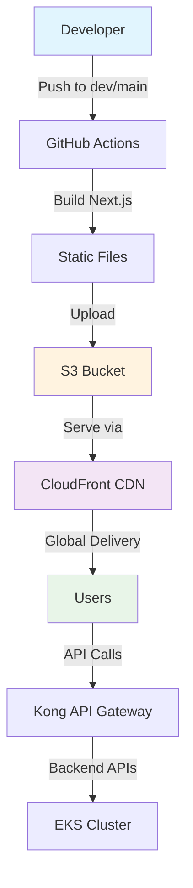

# 🎨 Frontend Integration Guide

This document explains how your `wholesale-ecommerce-website` project integrates with our AWS infrastructure using S3 + CloudFront for static hosting.

## 📋 Overview

Your Next.js frontend application is now fully integrated with our infrastructure and will be deployed to:
- **S3 Bucket**: Static file storage
- **CloudFront CDN**: Global content delivery
- **Automatic CI/CD**: GitHub Actions workflows

## 🏗️ Architecture



## 🔧 Configuration Changes Made

### 1. Next.js Configuration
Updated `wholesale-ecommerce-website/web/next.config.js`:
```javascript
const nextConfig = {
  output: 'export',           // Enable static export
  trailingSlash: true,        // Add trailing slashes
  images: {
    unoptimized: true,        // Disable image optimization for static export
    // ... existing remote patterns
  },
}
```

### 2. Terraform Frontend Module
Created `modules/frontend/` with:
- **S3 Bucket**: For static file hosting
- **CloudFront Distribution**: For CDN and caching
- **IAM Roles**: For CI/CD deployment
- **Security**: Bucket policies and encryption

### 3. Environment Integration
Updated both `dev` and `production` environments to include the frontend module.

## 🚀 Deployment Process

### Development Environment
1. **Push to `dev` branch** → Automatic deployment
2. **Build process**: `npm run build` → Creates `out/` folder
3. **Upload to S3**: Static files uploaded with proper caching headers
4. **CloudFront invalidation**: Cache cleared for immediate updates

### Production Environment
1. **Push to `main` branch** → Triggers workflow
2. **Manual approval required** → GitHub environment protection
3. **Same build and deployment process** as dev
4. **Slack notifications** for deployment status

## 📁 Project Structure

```
wholesale-ecommerce-website/
├── web/                          # Next.js application
│   ├── next.config.js           # ✅ Updated for static export
│   ├── package.json             # Build scripts
│   ├── src/                     # Source code
│   └── out/                     # 📦 Build output (created by npm run build)
│       ├── index.html           # Main HTML file
│       ├── _next/static/        # CSS, JS assets
│       └── public/              # Static assets
└── mobile/                      # React Native app (unchanged)

infrastructure_as_code/
├── modules/frontend/            # 🆕 Frontend infrastructure
│   ├── main.tf                 # S3 + CloudFront resources
│   ├── variables.tf            # Input variables
│   ├── outputs.tf              # Output values
│   └── versions.tf             # Provider constraints
└── environments/
    ├── dev/main.tf             # ✅ Updated to include frontend
    └── production/main.tf      # ✅ Updated to include frontend
```

## 🔄 CI/CD Workflows

### Frontend Dev Workflow (`.github/workflows/frontend-dev.yml`)
- **Trigger**: Push to `dev` branch
- **Steps**:
  1. 🟢 Validate (lint, build test)
  2. 🚀 Deploy (build, upload to S3, invalidate CloudFront)
  3. 📢 Slack notification

### Frontend Prod Workflow (`.github/workflows/frontend-prod.yml`)
- **Trigger**: Push to `main` branch
- **Steps**:
  1. 🟢 Validate (lint, build test)
  2. 💰 Cost estimation (Infracost)
  3. ⏳ Manual approval (GitHub environment)
  4. 🚀 Deploy (build, upload to S3, invalidate CloudFront)
  5. 📢 Slack notification

## 🌐 URLs and Access

After deployment, your frontend will be available at:

### Development
- **URL**: `https://[cloudfront-domain].cloudfront.net`
- **S3 Bucket**: `farmers-market-dev-frontend-[random]`
- **CloudFront**: Distribution ID from Terraform output

### Production
- **URL**: `https://[cloudfront-domain].cloudfront.net`
- **S3 Bucket**: `farmers-market-production-frontend-[random]`
- **CloudFront**: Distribution ID from Terraform output

## 🛠️ Local Development

### Building Your Project
```bash
cd wholesale-ecommerce-website/web
npm install
npm run build
```

### Testing Build Output
```bash
# Check if build was successful
ls -la out/
# Should see: index.html, _next/, public/

# Test locally
npx serve out/
# or
python -m http.server 8000 -d out/
```

## 🔧 Customization Options

### Custom Domain
To use a custom domain (e.g., `app.farmersmarket.com`):

1. **Update Terraform variables**:
```hcl
# In environments/dev/terraform.tfvars
frontend_domain = "app-dev.farmersmarket.com"
frontend_ssl_certificate_arn = "arn:aws:acm:us-east-1:123456789012:certificate/12345678-1234-1234-1234-123456789012"
```

2. **Update module call**:
```hcl
module "frontend" {
  source = "../../modules/frontend"
  
  project_name = var.project_name
  environment  = var.environment
  custom_domain = var.frontend_domain
  ssl_certificate_arn = var.frontend_ssl_certificate_arn
  
  tags = local.common_tags
}
```

### Environment Variables
Your Next.js app can use environment variables:

```bash
# In your build process
NEXT_PUBLIC_API_URL=https://your-api-gateway-url
NEXT_PUBLIC_ENVIRONMENT=production
```

## 📊 Monitoring and Logs

### CloudFront Logs
- **Access logs**: Available in S3 (if enabled)
- **Real-time metrics**: CloudWatch dashboard
- **Cache hit ratio**: Monitor performance

### Build Logs
- **GitHub Actions**: Check workflow runs
- **Build artifacts**: Available for download
- **Deployment status**: Slack notifications

## 🚨 Troubleshooting

### Common Issues

#### 1. Build Fails
```bash
# Check Node.js version
node --version  # Should be 18+

# Clear cache and reinstall
rm -rf node_modules package-lock.json
npm install
npm run build
```

#### 2. S3 Upload Fails
- Check AWS credentials in GitHub secrets
- Verify IAM role permissions
- Ensure S3 bucket exists (run Terraform first)

#### 3. CloudFront Not Updating
- Check invalidation status in AWS Console
- Verify cache headers in S3 upload
- Wait 5-15 minutes for global propagation

#### 4. 404 Errors
- Ensure `index.html` exists in S3
- Check CloudFront error pages configuration
- Verify S3 bucket website configuration

### Debug Commands

```bash
# Check Terraform outputs
cd infrastructure_as_code/environments/dev
terraform output frontend_url
terraform output frontend_s3_bucket
terraform output frontend_cloudfront_id

# Test S3 access
aws s3 ls s3://your-bucket-name/

# Test CloudFront
curl -I https://your-cloudfront-domain.cloudfront.net
```

## 💰 Cost Optimization

### Current Costs (Estimated)
- **S3 Storage**: ~$0.023/GB/month
- **CloudFront**: Free tier (1TB transfer/month)
- **Data Transfer**: $0.085/GB after free tier

### Optimization Tips
1. **Enable S3 compression**: Reduces transfer costs
2. **Optimize images**: Use WebP format
3. **Cache static assets**: Long cache headers for CSS/JS
4. **Monitor usage**: Set up billing alerts

## 🔐 Security

### Implemented Security Features
- **S3 bucket encryption**: AES-256
- **CloudFront HTTPS**: SSL/TLS termination
- **Origin Access Control**: Secure S3 access
- **IAM least privilege**: Minimal permissions for deployment

### Additional Security (Optional)
- **WAF**: Web Application Firewall
- **Custom SSL certificates**: For custom domains
- **Access logging**: CloudTrail integration

## 📈 Performance

### Optimizations Included
- **CloudFront CDN**: Global edge locations
- **Gzip compression**: Automatic compression
- **Cache headers**: Optimized for static assets
- **HTTP/2**: Modern protocol support

### Performance Monitoring
- **CloudWatch metrics**: Request count, error rates
- **Real User Monitoring**: Browser performance
- **Core Web Vitals**: LCP, FID, CLS tracking

## 🎯 Next Steps

1. **Deploy infrastructure**: Run Terraform to create S3 + CloudFront
2. **Test deployment**: Push to `dev` branch to trigger workflow
3. **Monitor performance**: Check CloudWatch metrics
4. **Set up custom domain**: Configure DNS and SSL certificate
5. **Enable monitoring**: Set up alerts and dashboards

## 📞 Support

For issues or questions:
- **GitHub Issues**: Create issue in this repository
- **Slack**: #deployments channel
- **Documentation**: Check other docs in `/docs` folder

---

**🎉 Your frontend is now fully integrated with our AWS infrastructure!**
